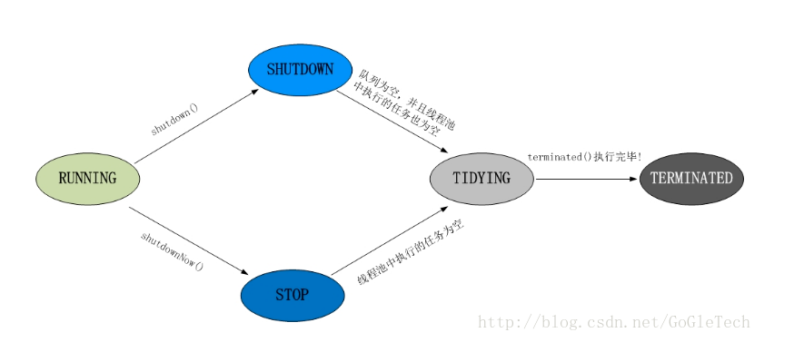

# 线程池

## 默认初始化方式
Java 默认提供四种连接池初始化方式
1. Executors.newSingleThreadExecutor()：创建一个单线程的连接池
2. Executors.newCacheThreadPool():创建一个可缓存线程的连接池，线程存活时间60s
3. Executors.newFixedThreadPool(int):创建一个固定大小的连接池
4. Executors.newScheduledThreadPool(int):创建一个固定大小可延迟执行任务的连接池

## ThreadPoolExecutor
Java 的连接池核心类是 ThreadPoolExecutor，默认的四种类型都是继承该类实现的

该类的构造方法有 7 个核心参数
- corePoolSize
- maximunPoolSize
- keepAliveTime
- timeUnit
- blockingQueue
- ThreadFactory
- rejectedExecutionHandler

**corePoolSize**

池中能够存活的最多核心线程数，当线程池没有设置 allowCoreThreadTimeOut 参数，核心线程创建了都不会被回收；如果设置 allowCoreThreadTimeOut 参数，则线程如果 idle 时间超过 keepAliveTime，则会被回收

**maximunPoolSize**

池中最大能创建的线程数，当线程数达到 core 后，但还未达到 max，且队列已经满了，则允许创建新的线程执行任务。大于 core 的线程，如果 idle 超过 keepAliveTime 时间，则会被回收

**keepAliveTime**

线程 idle 存活超过该时间则会被回收，默认只对大于 core 的线程进行 keepAlive

**timeUnit**

keepAliveTime 的单位

**blockingQueue**

任务队列，当池中线程数达到 core 时，任务会被提交到一个任务队列中，等待执行；若未达到 core，则会直接创建新的线程执行

**threadFactory**

接口类，定义一个 newThread() 方法,表示如何构建线程

**rejectedExecutionHandler**

定义当作业队列满时且无法再创建线程时，如何处理任务，默认是拒绝任务并丢弃
默认实现类型：
- AbortPolicy：拒绝任务并抛出异常 RejectExecutionException，默认值
- CallerRunsPolicy：直接用当前线程执行任务
- DiscardOldestPolicy：将任务队列队头任务丢弃，再重新 execute 任务
- DiscardPolicy：直接丢弃任务，但不抛异常
- NewThreadRunsPolicy：创建一条新线程执行任务


## 机制原理
ThreadPoolExecutor 有一个核心参数 ctl，该参数类型是 AtomicInteger，作用是记录当前线程池的状态与线程个数

ctl 是一个 32 位的整型，高3位记录了线程池状态，后29位用于记录线程池的线程个数，线程池状态有如下类型
- RUNNINT：能够接受新任务，以及对已添加的任务进行处理
- SHUTDOWN：不接收新任务，但是还能够处理已添加的任务
- STOP：不接收新任务，且会中断正在处理的任务
- TIDYING：所有任务已经终止
- TERMINATED：线程池已经彻底关闭

状态转移图：



线程池核心 API 有两个，分别是 execute 和 submit，这两个方法都用于执行任务，区别在于 submit 方法接收 Callable，该种任务可获取返回值，具体请查看 [Runnable 和 Callable 的区别](Runnable和Callable 的区别.md)

### execute(Runnable)
execute(Runnable):执行一个任务

```java
  public void execute(Runnable command) {
        if (command == null)
            throw new NullPointerException();
        /*
         * Proceed in 3 steps:
         *
         * 1. If fewer than corePoolSize threads are running, try to
         * start a new thread with the given command as its first
         * task.  The call to addWorker atomically checks runState and
         * workerCount, and so prevents false alarms that would add
         * threads when it shouldn't, by returning false.
         *
         * 2. If a task can be successfully queued, then we still need
         * to double-check whether we should have added a thread
         * (because existing ones died since last checking) or that
         * the pool shut down since entry into this method. So we
         * recheck state and if necessary roll back the enqueuing if
         * stopped, or start a new thread if there are none.
         *
         * 3. If we cannot queue task, then we try to add a new
         * thread.  If it fails, we know we are shut down or saturated
         * and so reject the task.
         */
        int c = ctl.get();
        if (workerCountOf(c) < corePoolSize) {
            if (addWorker(command, true))
                return;
            c = ctl.get();
        }
        if (isRunning(c) && workQueue.offer(command)) {
            int recheck = ctl.get();
            if (! isRunning(recheck) && remove(command))
                reject(command);
            else if (workerCountOf(recheck) == 0)
                addWorker(null, false);
        }
        else if (!addWorker(command, false))
            reject(command);
    }

private boolean addWorker(Runnable firstTask, boolean core) {
        retry:
        for (;;) {
            int c = ctl.get();
            int rs = runStateOf(c);

            // Check if queue empty only if necessary.
            if (rs >= SHUTDOWN &&
                ! (rs == SHUTDOWN &&
                   firstTask == null &&
                   ! workQueue.isEmpty()))
                return false;

            for (;;) {
                int wc = workerCountOf(c);
                if (wc >= CAPACITY ||
                    wc >= (core ? corePoolSize : maximumPoolSize))
                    return false;
                if (compareAndIncrementWorkerCount(c))
                    break retry;
                c = ctl.get();  // Re-read ctl
                if (runStateOf(c) != rs)
                    continue retry;
                // else CAS failed due to workerCount change; retry inner loop
            }
        }

        boolean workerStarted = false;
        boolean workerAdded = false;
        Worker w = null;
        try {
            w = new Worker(firstTask);
            final Thread t = w.thread;
            if (t != null) {
                final ReentrantLock mainLock = this.mainLock;
                mainLock.lock();
                try {
                    // Recheck while holding lock.
                    // Back out on ThreadFactory failure or if
                    // shut down before lock acquired.
                    int rs = runStateOf(ctl.get());

                    if (rs < SHUTDOWN ||
                        (rs == SHUTDOWN && firstTask == null)) {
                        if (t.isAlive()) // precheck that t is startable
                            throw new IllegalThreadStateException();
                        workers.add(w);
                        int s = workers.size();
                        if (s > largestPoolSize)
                            largestPoolSize = s;
                        workerAdded = true;
                    }
                } finally {
                    mainLock.unlock();
                }
                if (workerAdded) {
                    t.start();
                    workerStarted = true;
                }
            }
        } finally {
            if (! workerStarted)
                addWorkerFailed(w);
        }
        return workerStarted;
    }
```

流程：
1. 如果当前线程数小于 core，则尝试创建新线程处理任务，能够创建，则结束；
2. 如果线程数已经达到 core，则尝试将任务放进任务队列中，如果可以放进去，则结束；
3. 如果队列已经满了，且线程数还未达到 max，则尝试创建新线程处理任务，能够创建，则结束
4. 如果队列满了，且不能创建新线程，则触发 reject 任务

### submit(Callable)
提交一个任务，返回 Future 对象
```java
  public <T> Future<T> submit(Callable<T> task) {
        if (task == null) throw new NullPointerException();
        RunnableFuture<T> ftask = newTaskFor(task);
        execute(ftask);
        return ftask;
    }
```
该方法将 task 封装成 Future，再通过 execute 执行

### 任务执行
在线程池中，线程被封装成一个 Worker 对象，该对象存储了 Thread，任务的执行通过 runWork() 方法执行

``` java
  final void runWorker(Worker w) {
        Thread wt = Thread.currentThread();
        Runnable task = w.firstTask;
        w.firstTask = null;
        w.unlock(); // allow interrupts
        boolean completedAbruptly = true;
        try {
            while (task != null || (task = getTask()) != null) {
                w.lock();
                // If pool is stopping, ensure thread is interrupted;
                // if not, ensure thread is not interrupted.  This
                // requires a recheck in second case to deal with
                // shutdownNow race while clearing interrupt
                if ((runStateAtLeast(ctl.get(), STOP) ||
                     (Thread.interrupted() &&
                      runStateAtLeast(ctl.get(), STOP))) &&
                    !wt.isInterrupted())
                    wt.interrupt();
                try {
                    beforeExecute(wt, task);
                    Throwable thrown = null;
                    try {
                        task.run();
                    } catch (RuntimeException x) {
                        thrown = x; throw x;
                    } catch (Error x) {
                        thrown = x; throw x;
                    } catch (Throwable x) {
                        thrown = x; throw new Error(x);
                    } finally {
                        afterExecute(task, thrown);
                    }
                } finally {
                    task = null;
                    w.completedTasks++;
                    w.unlock();
                }
            }
            completedAbruptly = false;
        } finally {
            processWorkerExit(w, completedAbruptly);
        }
    }
```

流程：
1. 从 queue 里面获取任务，当 queue 空时，则阻塞等待；如果线程数大于 core 时，等待时间为 keepAliveTime，若超过该时间仍然没有任务，则线程会被回收，结束
2. 执行 beforeExecute
3. 执行 runnable.run()
4. 如果执行出错，则抛出异常；否则执行 afterExecute
5. 重复步骤1
