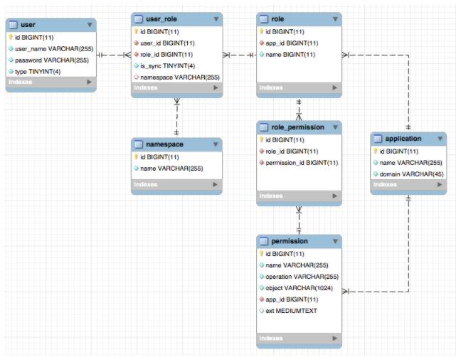
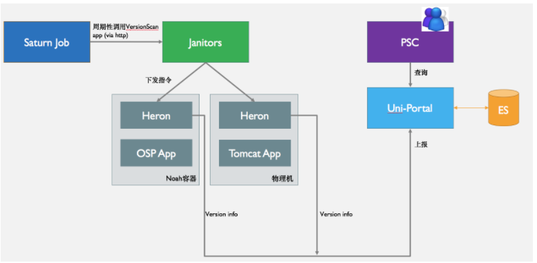
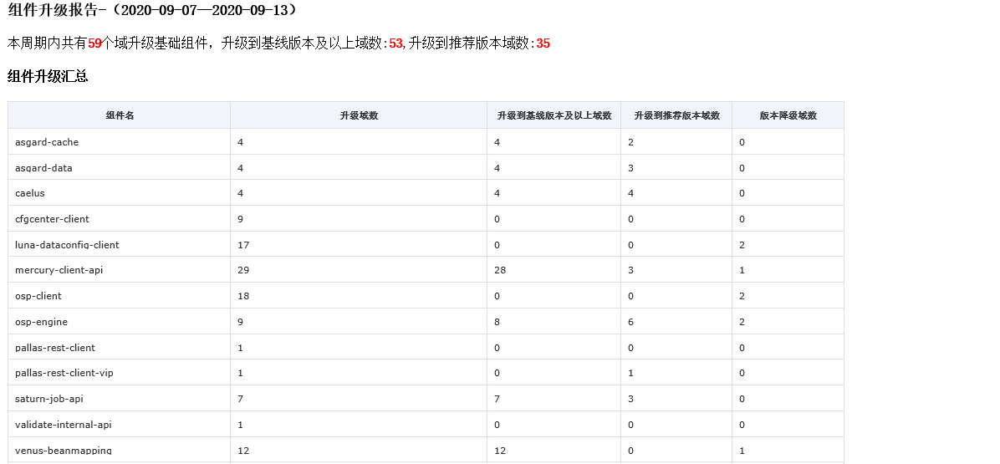
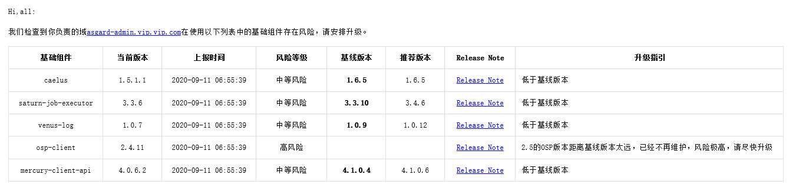

# 统计基础平台
## 统一权限模块
**调研：**
目标应用：基础平台中的所有 web 应用
权限使用的场景：基于角色、基于 API
模型：

**方案选型**
- 基于 spring security：支持原生注解 hasRole、hasPermission，支持编程式鉴权
- 基于 shiro：支持原生注解 requiresRole、requiresPermissions，支持编程式鉴权
	 
方案对比：
shiro 相对于 Spring security 使用起来更简单更方便，不需要配置繁琐的配置；但大多数目标应用都是基于 spring security 开发，为了让业务应用可以无缝接入，所以最终采用基于 Spring Security

最终权限模块的结构图为：

## 组件管理上报
**背景：**
应用规范化上云改造、组件版本升级管理

待解决的问题：
		- 兼容收集多种类型的客户端信息：分析不同类型的应用结构，定制化规则
		- 支持动态增加收集规则
	
实现结构：

服务提供方：

服务使用方：
