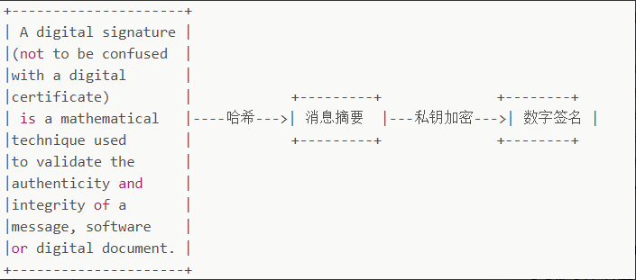
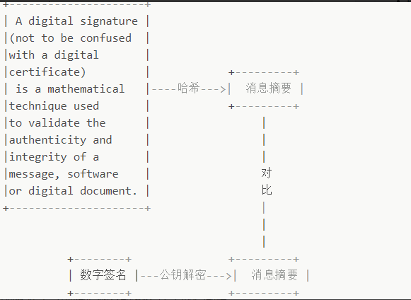
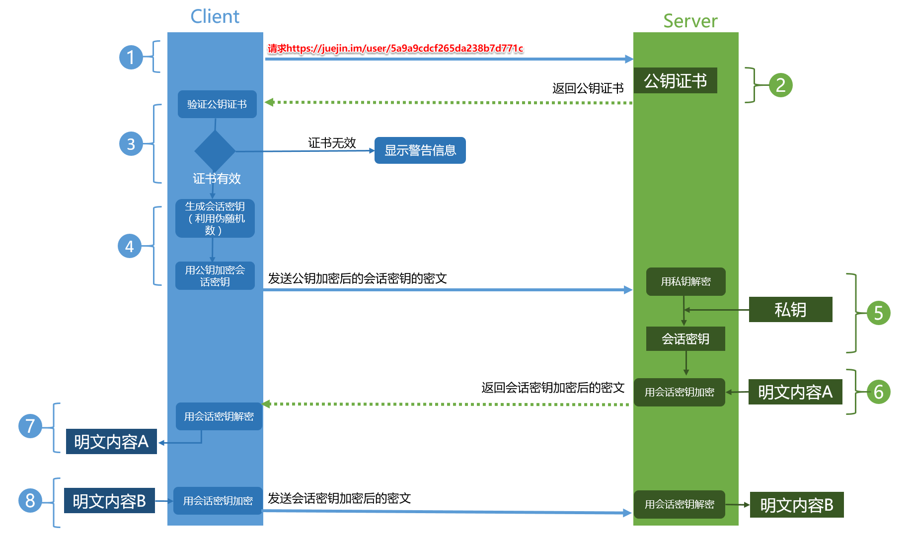

# Https 的原理
https = http + ssl/tls，即在 http 基础上增加 ssl/tls 安全协议层。http 协议采用明文通信，它存在数据安全、数据可能会被篡改，身份可能会被伪造的问题，因为 https 是为了解决已下3个问题：
- 数据隐私
- 数据完整
- 身份认证

## 基础概念
### 对称加密与非对称加密
保证数据的安全性，就需要对数据进行加密，加密有两种类型的算法，分别是对称加密算法和非对称加密算法。
**对称加密算法**
客户端与服务端使用同一把密钥进行加密解密
缺点：如果密钥被偷窃，数据仍然存在安全问题，因此密钥不适合直接传输

**非对称加密算法**
服务端生成一个私钥和公钥，私钥由服务端保存，而公钥是暴露的。客户端使用公钥加密，服务端采用密钥解密。
缺点：
1. 公钥是公开的，对于服务端发出的消息，仍然有可能会被其他人盗取
2. 公钥不包含服务器信息，使用非对称加密算法无法确保服务器身份的合法性，存在被篡改的风险
3. 非对称加密对于性能损耗比对称加密大

两种算法都有其缺点，因此 https 采用的对称加密+非对称加密混合的机制。
流程：先通过非对称加密算法传输对称加密算法的密钥，获取密钥成功后，数据报文传输采用对称加密算法进行加解密。

### 数字签名与数字证书
前面提到加密算法能够保证数据的安全性，但是不能避免身份认证、报文篡改的问题，因此引入数据签名和数据证书来解决。

**数字签名**
数字签名是为了解决数据完整性
数字签名的生成：
1. 先对数据报文进行 hash
2. 再使用私钥对 hash 进行加密生成数字签名

发送数据报文时，会同时生成数字签名一起发送过去，当收到报文后，客户端会校验数字报文的合法性，如果校验不通过，则认为不合法。
数字签名的校验：
1. 使用公钥对数字签名进行解密得到 hash
2. 对数据报文进行 hash，比对两个 hash 是否一致，一致则校验通过，否则校验不合法

**数字证书**
数字证书依赖第三方数字整数认证机构认证，证书包含了申请者公钥、申请者的组织信息和个人信息、签发机构 CA 的信息、有效时间、证书序列号，同时包含一个签名算法。

### https 的通信流程
1. 客户端采用 https 协议访问服务端上的资源
2. 服务端访问公钥证书
3. 客户端验证公钥证书，证书验证通过则采用伪随机数生成会话密钥
4. 用公钥加密会话密码，发送给服务端
5. 服务端用私钥解密，获取会话密钥
6. 客户端与服务端使用会话密钥进行通信

参考：https://juejin.im/post/6844903830916694030