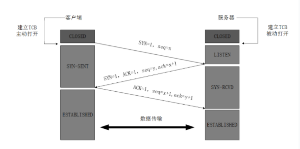
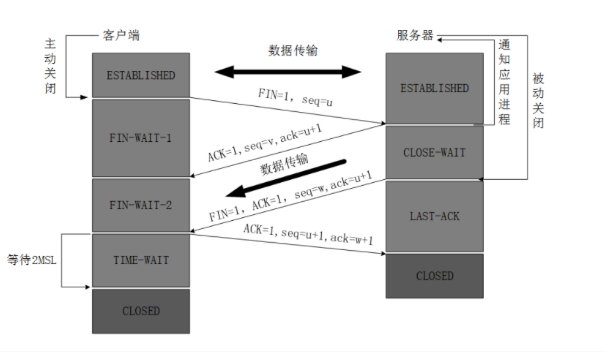

# 三次握手

**为什么要进行三次握手？**
>如果客户端第一个 SYN 包因为网络原因没有发送到服务端，客户端收不到服务端 ack 包，就会触发重传 SYN 包，此时的 SYN 传输成功了，服务端回复 SYN/ACK。如果此时客户端不需要回复 ACK，直接建立连接并通信。这时是没问题的。
但是当第一个丢失的 SYN 包后来又到达服务器了，服务器回复了，此时客户端收到会认为不合法的包将其丢弃，但是服务端不知道，服务端就会创建 socket，这样会导致服务端资源浪费

# 四次挥手

**为什么需要四次握手**
> 被动关闭的一方可能还存在数据未传输完毕，所以需要等待被动关闭的一方数据传输完毕后，再发送 fin 包通知可以关闭了

**为什么客户端需要处于 time-wait 阶段等待2个 ttl**
>因为防止最后一个 ack 报文没有传输到服务器，当服务端发送了  fin/ack 报文后，在收不到客户端 ack 报文会进行重传，则此时客户端收到服务端的第二次报文则可以重新发送 ack 报文

## time-wait 和 close-wait 
两种状态看上面挥手

**为什么服务器会出现大量 close-wait**
> 出现 close-wait  的原因是服务端主动关闭连接，客户端恢复了 ack 报文，但是一直没有发送 fin/ack 报文，此时大多数是因为连接泄露或者执行还在等待超时，导致连接一直被占用，没有主动进行 close 发送 ack/fin 包，这种情况一般需要检查代码，可以通过看业务错误日志或者火焰图看调用链分析代码

**为什么服务器会出现大量time-wait**
> 出现 time-wait 一般是客户端在某一时刻有并发比较高，且请求基本是处于短连接，因为 tcp 端口的可用范围一般是 0~65535 的范围，如果大量 socket 都处于这个状态，则有可能会导致某些请求出现 connect timeout 的错误